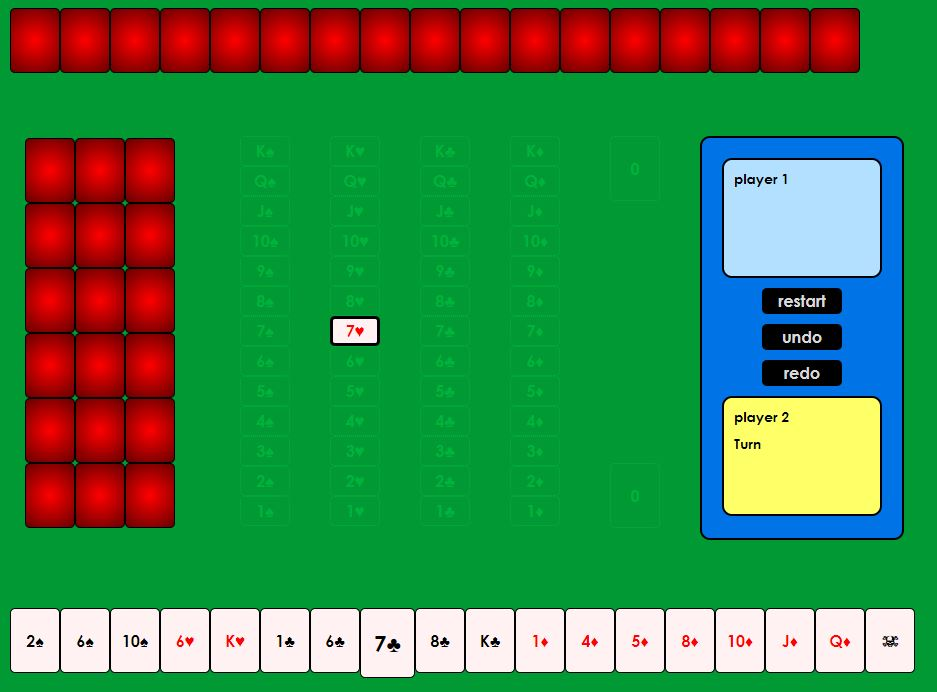

# Sevens
This is a two-players version [Sevens](https://en.wikipedia.org/wiki/Sevens_(card_game)) cards game invited by my sister and myself. A Pen created at CodePen.io. You can find this one at [here](https://codepen.io/whereitisvc/pen/NMzbRV).

## Introduction
In order to make it playable to two players (Sevens is originally designed for 3~4 players), some special rules are applied:
1. Two joker cards (red and black) are in the game. There are total 54 cards (13\*4+2).
2. At the start of the game, distribute 54 cards equally to three piles (18\*3): playerA hand, playerB hand and "WILD".
3. Red joker card can be any card in Heart or Diamond. Black joker card can be any card in Spade or Club.
4. After you fold a card (happen when you have no card can play), reveal one card from "WILD".
5. Whenever the revealed card in "WILD" is avaliable (can be moved to board), move it to board. Otherwise, leave it revealed in "WILD".

## Detail Rules
Above are the main new rules apply to two-players version Sevens game. There are still have several rules for special cases:

## Demo

